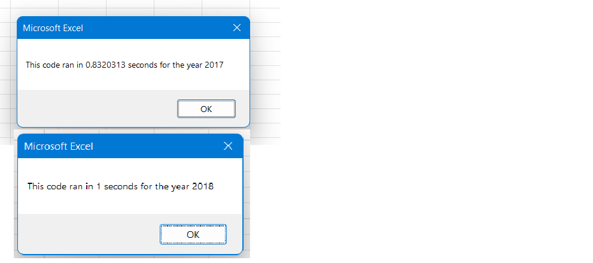

# Overview of Project: 
This project is to refactor a VBA script for Stock Market analysis to run more efficient. 

# Results: 
For the original 2017 and 2018 stock performance analysis, the VBA script performed well and within 2 seconds. Image 1 below shows the duration each script ran for analysis of the two years. 

Image 1:

Comparing the original script to the refactored script, the refactored script out performed the original by far. Image 2 and 3 below showcases the duration for each analysis per year coming in under 1 second. 

Image 2:

Image 3: 

# Summary: 
Overall, refactoring VBA scripts can bring on efficiency by taking fewer steps and using less memory. However, refactoring scripts that have been performing well may take time to review and decipher. Some may  result in more time in defining and reviewing existing VBA scripts that may be a loss of a resource. The orginal VBA scripts were performing in under 5 seconds but may take days/hours to refactor. The decision in refactoring scripts should be reviewed with the amount of effort to determine if it wil be beneficial. 